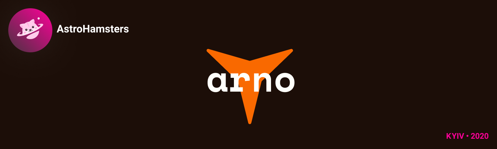
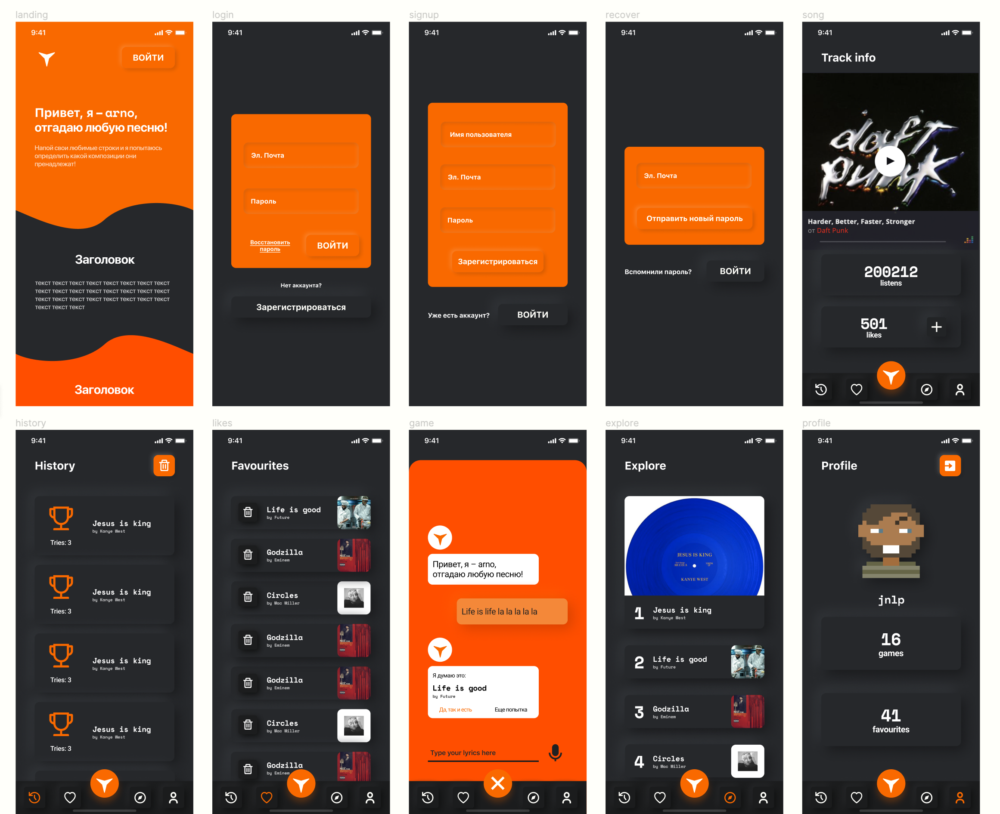

  

# arno – тестовое задание INT20H

### Как arno работает

Пользователь загадывает песню. Он вводит слова песни или записывает голосовое(так же как и в Shazam), а бот должен угадать эту песню и дать
прослушать. 
Пользователь отвечает:  

- песня угадана – бот победил
- ответ неверен – очко за юзером

### Техническое задание

- [x] Реализован один из перечисленных методов поиска трека на выбор
- [x] Вывод найденного трека
- [x] Возможность прослушать трек в приложении
- [x] Код разместить в открытом репозитории на github или подобном хранилище. В файле readme добавить инструкцию как запустить проект (задание без описания проверяться не будет)
- [x] Заполнить гугл-форму для сдачи работы до 25 января 23:59

#### Дополнительно

- [x] Реализация формы игры
  - [x] ответ на попытку угадать песню пользователя: угадана либо нет
  - [x] повтор попыток на угадывание песни до 5-ти раз
  - [x] вывод результата игры (победителя и правильный ответ)
- [x] Регистрация + Вход
- [x] Сохранение песен в Любимые
- [x] Оба метода поиска
- [x] Вывод истории игр

### Мы использовали API

- [Deezer](https://developers.deezer.com/api)
- [Audd](https://audd.io/)

### Дизайн

Все страницы приложения задизайнены [в фигме](https://www.figma.com/file/sj4pqs2WFnOPnzP6Cxugk2/arno?node-id=20%3A0)

 

## Запуск приложения

Мы сделали всё за вас и приложение уже готово к запуску [по ссылке](https://client.stanislavtihonov5.now.sh)

Но, если очень хочется, можете запустить локально

1.  Склонируйте этот репозиторий
2.  Установите все депенденси в директориях клиент и сервер 
    **Важно!** используйте `yarn install`
3.  Заполните .env для server'a, [пример тут](./server/.env.example)
4.  `yarn start` из каждой директории запустит соответсвующие юниты веб-приложения
5.  Дальнейшие инструкции будут выведены в консоль
